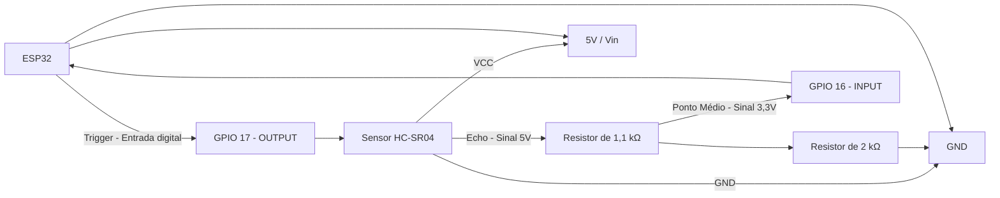
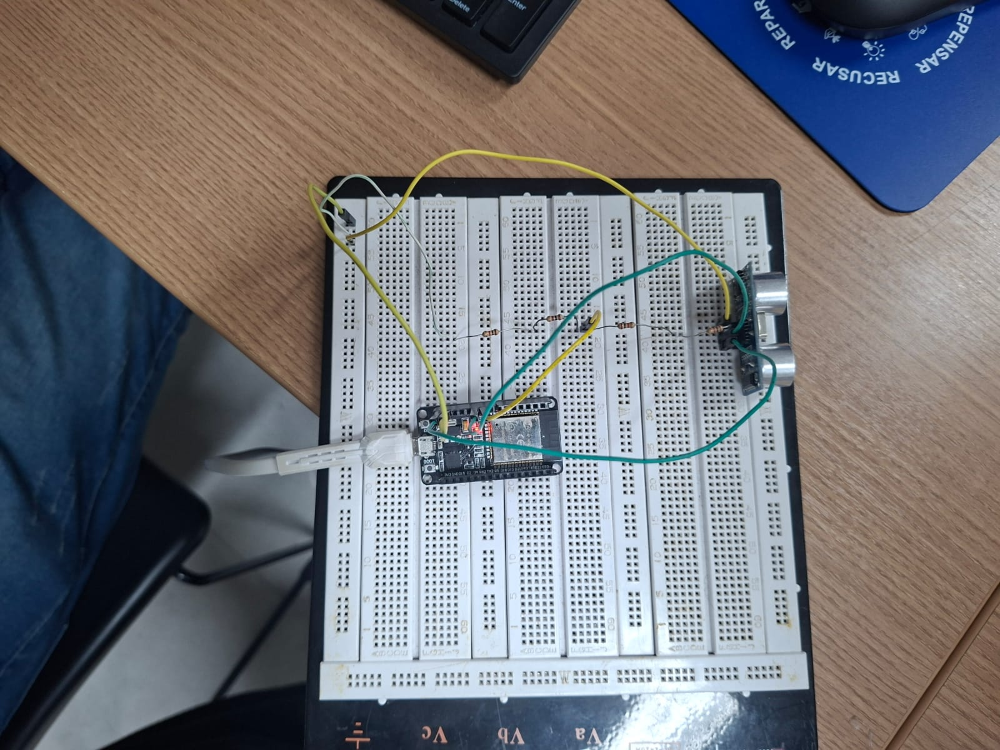

# Introdução

Este projeto apresenta o desenvolvimento de uma aplicação embarcada utilizando um microcontrolador ESP32, com o objetivo de aplicar conceitos fundamentais de leitura de sensores e comunicação serial para Internet das Coisas. A aplicação utiliza o sensor de ultrassom **HC-SR04** para determinar a distância de um objeto posicionado à sua frente.

O sistema foi programado para realizar a leitura da distância e enviar as informações textualmente via porta serial (ex.: `"Distância: 30 cm"`). Além disso, o código permite definir uma distância máxima de detecção personalizável; caso o objeto esteja além do limite estabelecido (ou fora da faixa de 2 cm a 400 cm especificada no *datasheet* do sensor), a leitura retorna o valor `0`. Para garantir a integridade do ESP32, a conexão do pino de saída de sinal (`ECHO`) do sensor utiliza um divisor de tensão com resistores para rebaixar os sinais lógicos de 5 V para o nível seguro de 3,3 V.

---

## Diagrama de montagem

A montagem utiliza um ESP32, um sensor ultrassônico HC-SR04 e dois resistores (1,1 kΩ e 2 kΩ) configurados em série como divisor de tensão para o pino `ECHO`. O pino `TRIG` envia o pulso de disparo, enquanto o pino `ECHO` fornece o sinal de retorno tratado ao microcontrolador[cite: 4].

## Montagem ESP32

## Com serial do Arduino IDE

> Meio borrado, mas funcionando
